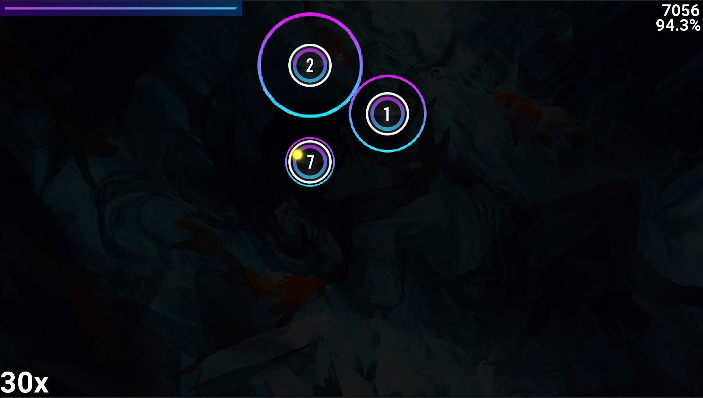

<h1 align="center">
  <br>
 
</h1>

<h4 align="center">Circle Clicker is a casual Java project in the libGDX framework that lets you test your rhythm and reflexes with simple, beat-filled clicking fun, inspired by osu!.</h4>
<p align="center">
	<a href="#description">Description</a> •
  <a href="#key-features">Key Features</a> •
  <a href="#key-features">How Does It Work?</a> •
  <a href="#requirements">Requirements</a> •
  <a href="#how-to-use">How To Use</a> •
  <a href="#credits">Credits</a> 
	
</p>

## [Click this for gameplay video!](https://www.youtube.com/watch?v=J-QQoqouXfU)



## Description
**Circle Clicker** is a simple Java project brought to life with the libGDX framework, providing a glimpse of rhythmic gaming inspired by _osu!_, using osu beatmap file format While it doesn't aspire to be a full-fledged game, Circle Clicker brings a bit of casual fun and rhythm into your gaming experience.

<strong>Please remember that Circle Clicker is not a full-fledged game, but rather a demo showcasing my initial foray into game development. It does not use parameters like circle size, approach rate e.t.c. For the real experience check out [osu!](https://osu.ppy.sh/home)</strong>
 

## Key Features

* Load maps from osu!
	- Choose the music You like
	- Challenge yourself by trying out different difficulty levels to suit your skill
	
 * Aim and click circles to the beat
	 - Test your precision and timing by clicking circles in perfect rhythm, aiming to hit them before they disappear
	 - Strive for flawless timing and accuracy to achieve the highest score possible
* Earn Points Based on Timing
	- Get 300, 100, or 50 points from a single hit, depending on how closely you time your click to the circle's rhythm
	- Don't miss a beat, or you'll break your combo and lose out on score multiplier
*  Showcase your map score
	- Monitor your total score, accuracy, and the number of individual hits for a comprehensive overview of your performance
	- Be graded based on your accuracy and miss count, providing a clear measure of your rhythmic proficiency

## How Does It Work?

## Requirements
* At least 1920x1080 (FHD) resolution screen
* JDK 9+
## How To Use

To clone the repo use
```
git clone https://github.com/Misiac/worse-osu.git
```
You can use it via your IDE
or build the jlink package with
```
mvn javafx:jlink
```

## Credits
